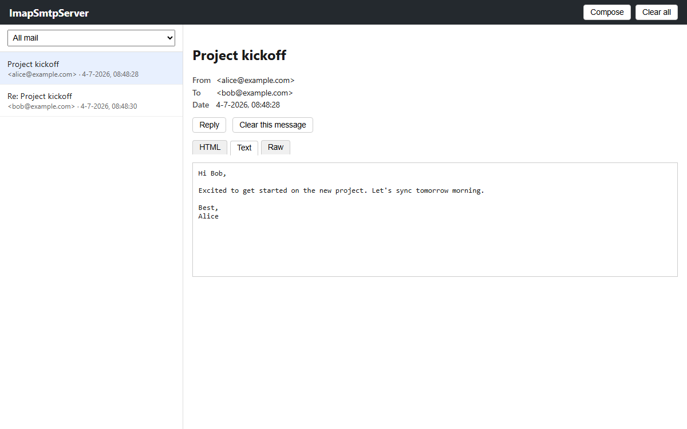

# ImapSmtpServer

A very simple dev-only SMTP/IMAP mail catcher with a web UI, in the spirit of
[Mailpit](https://github.com/axllent/mailpit). Written in Go. No auth, no
relaying, no persistence — everything lives in memory and is gone on restart.

Multiple mail accounts are supported: any email address that has sent or
received mail is automatically its own account (nothing to configure), and
the web UI can compose new messages and reply to existing ones - "send" and
"reply" both submit to the server's own SMTP port, so composed mail flows
through the exact same path as mail from an external client.



## Status

Done:
- [x] `internal/store` — thread-safe in-memory message store (add/list/get/delete/clear, UID tracking for IMAP, `\Seen` flag), plus per-account `Inbox`/`Sent` views and change notifications for SSE
- [x] `internal/mailparse` — parses raw RFC822 bytes into subject/from/to/date/text/html/attachments/Message-Id/In-Reply-To using `go-message/mail`
- [x] `internal/smtpd` — minimal SMTP server (`github.com/emersion/go-smtp`), accepts any sender/recipient, no auth required, parses each message and adds it to the store
- [x] `internal/imapd` — read-only IMAP server (`github.com/emersion/go-imap`); the login username selects the account, exposing that account's `INBOX` (received) and `Sent` (sent) mailboxes
- [x] `internal/web` — REST API + embedded static frontend: list/view/download/clear mail, browse by account/folder, compose and reply (`POST /api/send`), live updates over Server-Sent Events (`GET /api/events`)
- [x] `cmd/imapsmtpserver/main.go` — wires SMTP + IMAP + web servers together, graceful shutdown on SIGINT/SIGTERM
- [x] End-to-end tests (`cmd/imapsmtpserver/e2e_test.go`): single-account SMTP → web → IMAP → clear flow, and a multi-account test that sends alice → bob, replies bob → alice, and checks each account's IMAP INBOX/Sent are correctly isolated

## Running

```sh
go build ./...
go run ./cmd/imapsmtpserver
```

Ports default to 1025 (SMTP), 1143 (IMAP) and 8025 (web), and can be
overridden:

```sh
go run ./cmd/imapsmtpserver -smtp-port 2525 -imap-port 1144 -web-port 8080
```

Then:
- Send test mail to `localhost:1025` (no auth) — e.g. `swaks --to a@b.test --server localhost:1025`
- Open `http://localhost:8025` for the web UI — pick an account from the
  dropdown to see its Inbox/Sent, or use "Compose"/"Reply" to send mail
  between accounts
- Point a mail client at `localhost:1143`, logging in as the account address
  you want to browse (any password) — `INBOX` and `Sent` are separate
  mailboxes

## Layout

```
cmd/imapsmtpserver/   main.go (entrypoint), e2e_test.go
internal/store/       in-memory message store, per-account inbox/sent views
internal/mailparse/   RFC822 -> store.Message parsing
internal/smtpd/       SMTP server
internal/imapd/       IMAP server (read-only, per-account, backed by internal/store)
internal/web/         HTTP API + static frontend (internal/web/static)
```

## Notes for future work

- The IMAP backend only tracks the `\Seen` flag; other flag updates (e.g.
  `\Deleted`, `\Flagged`) are accepted but silently dropped since there's no
  persistence to back them.
- `CreateMessage`/`CopyMessages` on the IMAP mailbox return an error — mail
  only arrives via SMTP (directly, or looped back through the web UI's
  send/reply), this is a read-only mailbox by design.
- The web frontend gets live updates via `GET /api/events` (SSE): the
  backend pushes an `update` event whenever the store changes, and the
  frontend refetches the current list in response. `EventSource` reconnects
  automatically on drop; polling is only used as a fallback if the browser
  doesn't support SSE.
- Accounts are inferred, not configured: an address becomes visible in the
  account dropdown / as an IMAP login only after it has appeared in a
  message's From or To. There's no address book or validation that a "to"
  address is well-formed beyond basic parsing.
- `POST /api/send` builds a plain-text-only RFC822 message; there's no rich
  text/HTML compose or attachment upload from the web UI yet.
